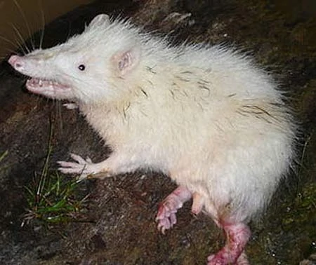

# A demo dataset for wildlife disease sampling

Between 2015 and 2018, the PREDICT program in Malaysia tested a total of nine moonrats (_Echinosorex gymnura_) for various viruses, including paramyxoviruses (the group that includes viruses like Nipah virus, Hendra virus, and measles). They tested 17 samples from those 9 individuals, examining a mix of oral and rectal swabs. One came back positive, leading to the discovery of a new virus: PREDICT PMV-120.	

Some technical details about the raw data: raw-animals.csv and raw-tests.csv come from the PREDICT 2 data release from USAID (and are a subset of public data). There are metadata issues between them that are a bit murky, so it's useful to put in writing that 

...in the **animals** object:
- PREDICT_IndividualID is the animal identifier
- PREDICT_EventID is basically a "Trip identifier": trip 2345	is the only one with multiple animals, caught on 2017-01-15	and 2017-01-16 (a day apart) at the same site.
- AnimalID is a separate field that has a 1:1 correspondence with animal identifiers in PREDICT_IndividualID (i.e., "nicknames") 
- there's also metadata on age, condition, sex, ID certainty, etc.
- redundant information on long-lat and date is also present

...in the **tests** object:
- PREDICT_TestID is a unique field for each test run
- PREDICT_SampleID is the actual animal identifier (yes, this is confusing)
- SpecimenID is a separate field that has a 1:1 correspondence with test identifiers in PREDICT_SampleID
- there's also metadata on what tests they ran, the results, the sequences, the GenBank Accession, the pathogen detected
- redundant information on long-lat and date is also present

...to join them:
- PREDICT_SampleID in tests == PREDICT_IndividualID in animals == the nine identifiable animals

